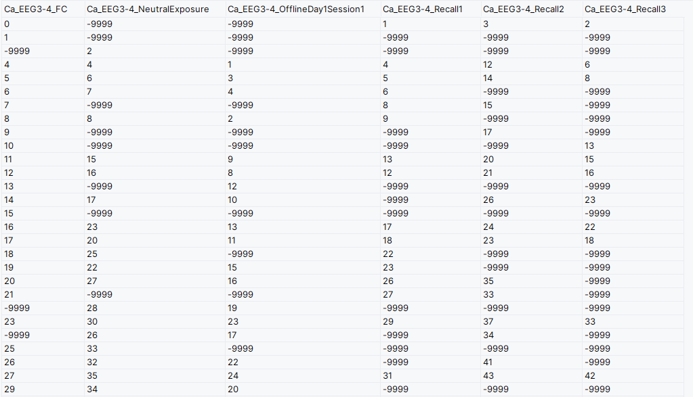

# Notes concerning the Zaki 2024 conversion

## General Information 
The lab page:
https://www.denisecailab.com/

The lab code:
https://github.com/denisecailab/RetrospectiveMemoryLinkingAnalysis_2024

The paper:
https://doi.org/10.1038/s41586-024-08168-4

## Experiment Protocol
A description of the experiment from the methods section of the paper [Offline ensemble co-reactivation links memories across days](https://doi.org/10.1038/s41586-024-08168-4):

> For calcium imaging experiments with simultaneous EEG and EMG recordings, mice lived in a custom-made homecage where offline recordings could take place. These homecages (Maze Engineers) were custom designed to accommodate mice wearing a Miniscope chronically for the duration of the experiment (about 2 weeks total). The water spout and food hopper were side-mounted and there was a slit along the top of the homecage so that the Miniscope coaxial cable could freely move. This homecage was placed on top of a receiver that would wirelessly receive EEG, EMG, temperature, and locomotion telemetry data continuously throughout the experiment (HD-X02, Data Science International). Mice had a Miniscope attached on the first day and allowed to wear it for an hour in their homecage to acclimate to its weight, after which it was removed. On the second day, the Miniscope was attached and remained on for the duration of the experiment, for a total of 2 weeks. The Miniscope was connected to a lightweight coaxial cable (Cooner Wire) which connected to a low-torque passive commutator (Neurotek) to allow the mice to freely move around the homecage with minimal rotational force. After exposure to the neutral context during encoding, mice were immediately returned to their homecage in the vivarium and the first calcium imaging recording began. The Miniscope DAQ was connected to an Arduino with a schedule set up to send a 10-minute long TTL pulse to record for 10 minutes, with a 20-minute break in between, repeated 24 times. Thus, we sampled 4 hours worth of calcium imaging data across 12 hours. The telemetry probe recorded continuously for the duration of the experiment while the mouse was in its homecage in the vivarium.
> 


What data is available per protocol day:

### Encoding
* Day 1:
  * Neutral
    - Video of behavior
    - Freezing analysis output
    - Calcium imaging and Segmentation
  * Offline
    - Calcium imaging and Segmentation
    - EEG and EMG
* Day 3:
  * Aversive - Fear Conditioning (FC):
    - Video of behavior
    - Freezing analysis output
    - Calcium imaging and Segmentation
    - Shock stimulus times
  * Offline
    - Calcium imaging and Segmentation
    - EEG and EMG
    - Sleep classification

### Recall
* Day 4: 
  * Recall1
    - Video of behavior
    - Freezing analysis output
    - Calcium imaging and Segmentation
* Day 5: 
  * Recall2
    - Video of behavior
    - Freezing analysis output
    - Calcium imaging and Segmentation
* Day 6: 5 minutes of video
    - Video of behavior
    - Freezing analysis output
    - Calcium imaging and Segmentation

## File structure 
File structure expected to run `define_conversion_parameters` form `utils/define_conversion_parameters.py`

The top level of the data is divided by **modalities** and inside the modalities we have data for each subject. 

```
├── Ca_EEG_Calcium  (this contains the segmentation data )
│   ├── Ca_EEG2-1
│   └── Ca_EEG3-4
├── Ca_EEG_EDF (this contains the EEG and EMG data)
│   ├── Ca_EEG2-1_EDF
│   └── Ca_EEG3-4_EDF
├── Ca_EEG_Experiment (this contains the raw miniscope data and behavioral videos)
│   ├── Ca_EEG2-1
│   └── Ca_EEG3-4 
└── Ca_EEG_Sleep  (Sleep data)
    ├── Ca_EEG2-1
    └── Ca_EEG3-4
```

### Ca_EEG_Calcium

Contain the minian data, a freezing output csv and the cell registration that contains csv files for each folder.

```
├── Ca_EEG2-1
│   ├── Ca_EEG2-1_FC
│   │   ├── Ca_EEG2-1_FC_FreezingOutput.csv
│   │   ├── metaData.json
│   │   └── minian
│   ├── Ca_EEG2-1_NeutralExposure
│   │   ├── Ca_EEG2-1_NeutralExposure_FreezingOutput.csv
│   │   ├── metaData.json
│   │   └── minian
│   ├── Ca_EEG2-1_OfflineDay2Session1
│   │   ├── metaData.json
│   │   └── minian
│   ├── Ca_EEG2-1_OfflineDay2Session10
│   │   ├── metaData.json
│   │   └── minian
│   ├── Ca_EEG2-1_OfflineDay2Session11
│   │   ├── metaData.json
│   │   └── minian
│   ├── Ca_EEG2-1_OfflineDay2Session12
│   │   ├── metaData.json
│   │   └── minian
│   ├── Ca_EEG2-1_OfflineDay2Session13
│   │   ├── metaData.json
│   │   └── minian
│   ├── Ca_EEG2-1_OfflineDay2Session14
│   │   ├── metaData.json
│   │   └── minian
│   ├── Ca_EEG2-1_OfflineDay2Session15
│   │   ├── metaData.json
│   │   └── minian
│   ├── Ca_EEG2-1_OfflineDay2Session16
│   │   ├── metaData.json
│   │   └── minian
│   ├── Ca_EEG2-1_OfflineDay2Session17
│   │   ├── metaData.json
│   │   └── minian
│   ├── Ca_EEG2-1_OfflineDay2Session18
│   │   ├── metaData.json
│   │   └── minian
│   ├── Ca_EEG2-1_OfflineDay2Session19
│   │   ├── metaData.json
│   │   └── minian
│   ├── Ca_EEG2-1_OfflineDay2Session2
│   │   ├── metaData.json
│   │   └── minian
│   ├── Ca_EEG2-1_OfflineDay2Session3
│   │   ├── metaData.json
│   │   └── minian
│   ├── Ca_EEG2-1_OfflineDay2Session4
│   │   ├── metaData.json
│   │   └── minian
│   ├── Ca_EEG2-1_OfflineDay2Session5
│   │   ├── metaData.json
│   │   └── minian
│   ├── Ca_EEG2-1_OfflineDay2Session6
│   │   ├── metaData.json
│   │   └── minian
│   ├── Ca_EEG2-1_OfflineDay2Session7
│   │   ├── metaData.json
│   │   └── minian
│   ├── Ca_EEG2-1_OfflineDay2Session8
│   │   ├── metaData.json
│   │   └── minian
│   ├── Ca_EEG2-1_OfflineDay2Session9
│   │   ├── metaData.json
│   │   └── minian
│   ├── Ca_EEG2-1_Recall1
│   │   ├── Ca_EEG2-1_Recall1_FreezingOutput.csv
│   │   ├── metaData.json
│   │   └── minian
│   ├── Ca_EEG2-1_Recall2
│   │   └── Ca_EEG2-1_Recall2_FreezingOutput.csv
│   ├── Ca_EEG2-1_Recall3
│   │   └── Ca_EEG2-1_Recall3_FreezingOutput.csv
│   └── SpatialFootprints
│       ├── CellRegResults_OfflineDay2Session1
│       ├── CellRegResults_OfflineDay2Session10
│       ├── CellRegResults_OfflineDay2Session11
│       ├── CellRegResults_OfflineDay2Session12
│       ├── CellRegResults_OfflineDay2Session13
│       ├── CellRegResults_OfflineDay2Session14
│       ├── CellRegResults_OfflineDay2Session15
│       ├── CellRegResults_OfflineDay2Session16
│       ├── CellRegResults_OfflineDay2Session17
│       ├── CellRegResults_OfflineDay2Session18
│       ├── CellRegResults_OfflineDay2Session19
│       ├── CellRegResults_OfflineDay2Session2
│       ├── CellRegResults_OfflineDay2Session3
│       ├── CellRegResults_OfflineDay2Session4
│       ├── CellRegResults_OfflineDay2Session5
│       ├── CellRegResults_OfflineDay2Session6
│       ├── CellRegResults_OfflineDay2Session7
│       ├── CellRegResults_OfflineDay2Session8
│       └── CellRegResults_OfflineDay2Session9

```

### CA_EEG_Experiment

The structure is:

```
.
├── Ca_EEG2-1_Offline
│   ├── Ca_EEG2-1_OfflineDay1
│   ├── Ca_EEG2-1_OfflineDay2
│   └── Ca_EEG2-1_OfflinePre
├── Ca_EEG2-1_Sessions
│   ├── Ca_EEG2-1_FC
│   ├── Ca_EEG2-1_NeutralExposure
│   ├── Ca_EEG2-1_Recall1
│   ├── Ca_EEG2-1_Recall2
│   └── Ca_EEG2-1_Recall3
└── Session_Timestamps.csv

```

For subject Ca_EEG3-4, the experiment folder contains a file named `Ca_EEG3-4_SessionTimes.csv` that looks like this:

For subject Ca_EEG2-1, the experiment folder contains a file named `Session_Timestamps.csv` that looks like this:

The offline data are different from the conditioning sessions data. The conditioning sessions are structured as:

```
├── Ca_EEG2-1_FC
│   ├── 10_11_24
│   │   ├── metaData.json
│   │   ├── Miniscope
│   │   │   ├── 0.avi
│   │   │   ├── 1.avi
│   │   │   ├── 2.avi
│   │   │   ├── 3.avi
│   │   │   ├── 4.avi
│   │   │   ├── 5.avi
│   │   │   ├── 6.avi
│   │   │   ├── 7.avi
│   │   │   ├── 8.avi
│   │   │   ├── headOrientation.csv
│   │   │   ├── metaData.json
│   │   │   ├── minian.mp4
│   │   │   └── timeStamps.csv
│   │   └── notes.csv
│   ├── Ca_EEG2-1_FC_FreezingOutput.csv
│   ├── Ca_EEG2-1_FC.raw
│   ├── Ca_EEG2-1_FC.txt
│   └── Ca_EEG2-1_FC.wmv
├── Ca_EEG2-1_NeutralExposure
│   ├── 10_43_54_first_attempt
│   │   ├── metaData.json
│   │   ├── Miniscope
│   │   │   ├── 0.avi
│   │   │   ├── headOrientation.csv
│   │   │   ├── metaData.json
│   │   │   └── timeStamps.csv
│   │   └── notes.csv
│   ├── 10_44_18
│   │   ├── metaData.json
│   │   ├── Miniscope
│   │   │   ├── 0.avi
│   │   │   ├── 10.avi
│   │   │   ├── 11.avi
│   │   │   ├── 12.avi
│   │   │   ├── 13.avi
│   │   │   ├── 14.avi
│   │   │   ├── 15.avi
│   │   │   ├── 16.avi
│   │   │   ├── 17.avi
│   │   │   ├── 1.avi
│   │   │   ├── 2.avi
│   │   │   ├── 3.avi
│   │   │   ├── 4.avi
│   │   │   ├── 5.avi
│   │   │   ├── 6.avi
│   │   │   ├── 7.avi
│   │   │   ├── 8.avi
│   │   │   ├── 9.avi
│   │   │   ├── bad_frames
│   │   │   │   ├── 14811.png
│   │   │   │   ├── 15018.png
│   │   │   │   ├── 15098.png
│   │   │   │   └── 15099.png
│   │   │   ├── failed_to_fix
│   │   │   │   ├── 14.avi
│   │   │   │   └── 15.avi
│   │   │   ├── headOrientation.csv
│   │   │   ├── metaData.json
│   │   │   ├── minian.mp4
│   │   │   ├── originals
│   │   │   │   ├── 14.avi
│   │   │   │   └── 15.avi
│   │   │   └── timeStamps.csv
│   │   └── notes.csv
│   ├── Ca_EEG2-1_NeutralExposure_first_attempt.raw
│   ├── Ca_EEG2-1_NeutralExposure_first_attempt.txt
│   ├── Ca_EEG2-1_NeutralExposure_first_attempt.wmv
│   ├── Ca_EEG2-1_NeutralExposure_FreezingOutput.csv
│   ├── Ca_EEG2-1_NeutralExposure.raw
│   ├── Ca_EEG2-1_NeutralExposure.txt
│   └── Ca_EEG2-1_NeutralExposure.wmv
├── Ca_EEG2-1_Recall1
│   ├── 10_33_20
│   │   ├── metaData.json
│   │   ├── Miniscope
│   │   │   ├── 0.avi
│   │   │   ├── 1.avi
│   │   │   ├── 2.avi
│   │   │   ├── 3.avi
│   │   │   ├── 4.avi
│   │   │   ├── 5.avi
│   │   │   ├── 6.avi
│   │   │   ├── 7.avi
│   │   │   ├── 8.avi
│   │   │   ├── headOrientation.csv
│   │   │   ├── metaData.json
│   │   │   ├── minian.mp4
│   │   │   └── timeStamps.csv
│   │   └── notes.csv
│   ├── Ca_EEG2-1_Recall1_FreezingOutput.csv
│   ├── Ca_EEG2-1_Recall1.raw
│   ├── Ca_EEG2-1_Recall1.txt
│   └── Ca_EEG2-1_Recall1.wmv
├── Ca_EEG2-1_Recall2
│   ├── Ca_EEG2-1_Recall2_FreezingOutput.csv
│   ├── Ca_EEG2-1_Recall2.raw
│   ├── Ca_EEG2-1_Recall2.txt
│   └── Ca_EEG2-1_Recall2.wmv
└── Ca_EEG2-1_Recall3
    ├── Ca_EEG2-1_Recall3_FreezingOutput.csv
    ├── Ca_EEG2-1_Recall3.raw
    ├── Ca_EEG2-1_Recall3.txt
    └── Ca_EEG2-1_Recall3.wmv

```

The offline days are structured like this:

```
├── Ca_EEG2-1_OfflineDay1
│   └── 2021_10_12
│       ├── 10_05_57
│       ├── 10_08_17
│       ├── 10_10_44
│       ├── 10_15_50
│       └── 12_07_50
├── Ca_EEG2-1_OfflineDay2
│   └── 2021_10_14
│       ├── 09_24_27
│       ├── 09_54_27
│       ├── 10_24_27
│       ├── 10_54_27
│       ├── 11_24_26
│       ├── 11_54_26
│       ├── 12_24_26
│       ├── 12_54_26
│       ├── 13_24_26
│       ├── 13_54_26
│       ├── 14_24_25
│       ├── 14_54_25
│       ├── 15_24_25
│       ├── 15_54_25
│       ├── 16_24_25
│       ├── 16_54_24
│       ├── 17_24_24
│       ├── 17_54_24
│       └── 18_24_24
└── Ca_EEG2-1_OfflinePre
    └── 2021_10_10
        ├── 11_05_22
        ├── 11_35_22
        ├── 12_05_22
        ├── 12_35_22
        ├── 13_05_21
        ├── 13_35_21
        ├── 14_05_21
        ├── 14_35_21
        ├── 15_05_21
        ├── 15_35_21
        ├── 16_05_20
        └── 16_35_20
```

And each of them is a date followed by a timestamp that has the miniscope data and the notes. They look like this:

```
├── 10_05_57
│   ├── behaviorTracker
│   ├── metaData.json
│   ├── My_V4_Miniscope
│   └── notes.csv
├── 10_08_17
│   ├── behaviorTracker
│   ├── metaData.json
│   ├── My_V4_Miniscope
│   └── notes.csv
├── 10_10_44
│   ├── behaviorTracker
│   ├── metaData.json
│   ├── My_V4_Miniscope
│   └── notes.csv
├── 10_15_50
│   ├── behaviorTracker
│   ├── metaData.json
│   ├── My_V4_Miniscope
│   └── notes.csv
└── 12_07_50
    ├── behaviorTracker
    ├── metaData.json
    ├── My_V4_Miniscope
    └── notes.csv

```

### Ca_EEG_Sleep 

The sleep classification folder looks like this:

```
├── Ca_EEG2-1
│   ├── AlignedSleep
│   │   ├── Ca_EEG2-1_OfflineDay2Session10_AlignedSleep.csv
│   │   ├── Ca_EEG2-1_OfflineDay2Session11_AlignedSleep.csv
│   │   ├── Ca_EEG2-1_OfflineDay2Session12_AlignedSleep.csv
│   │   ├── Ca_EEG2-1_OfflineDay2Session13_AlignedSleep.csv
│   │   ├── Ca_EEG2-1_OfflineDay2Session14_AlignedSleep.csv
│   │   ├── Ca_EEG2-1_OfflineDay2Session15_AlignedSleep.csv
│   │   ├── Ca_EEG2-1_OfflineDay2Session16_AlignedSleep.csv
│   │   ├── Ca_EEG2-1_OfflineDay2Session17_AlignedSleep.csv
│   │   ├── Ca_EEG2-1_OfflineDay2Session18_AlignedSleep.csv
│   │   ├── Ca_EEG2-1_OfflineDay2Session19_AlignedSleep.csv
│   │   ├── Ca_EEG2-1_OfflineDay2Session1_AlignedSleep.csv
│   │   ├── Ca_EEG2-1_OfflineDay2Session2_AlignedSleep.csv
│   │   ├── Ca_EEG2-1_OfflineDay2Session3_AlignedSleep.csv
│   │   ├── Ca_EEG2-1_OfflineDay2Session4_AlignedSleep.csv
│   │   ├── Ca_EEG2-1_OfflineDay2Session5_AlignedSleep.csv
│   │   ├── Ca_EEG2-1_OfflineDay2Session6_AlignedSleep.csv
│   │   ├── Ca_EEG2-1_OfflineDay2Session7_AlignedSleep.csv
│   │   ├── Ca_EEG2-1_OfflineDay2Session8_AlignedSleep.csv
│   │   └── Ca_EEG2-1_OfflineDay2Session9_AlignedSleep.csv
│   ├── Ca_EEG2-1_avgsummary.csv
│   ├── Ca_EEG2-1_powersummary.csv
│   ├── Ca_EEG2-1_summary.pickle
│   └── Ca_EEG2-1_transitions.pickle
└── Ca_EEG3-4
    ├── AlignedSleep
    │   ├── Ca_EEG3-4_OfflineDay1Session10_AlignedSleep.csv
    │   ├── Ca_EEG3-4_OfflineDay1Session11_AlignedSleep.csv
    │   ├── Ca_EEG3-4_OfflineDay1Session12_AlignedSleep.csv
    │   ├── Ca_EEG3-4_OfflineDay1Session13_AlignedSleep.csv
    │   ├── Ca_EEG3-4_OfflineDay1Session14_AlignedSleep.csv
    │   ├── Ca_EEG3-4_OfflineDay1Session15_AlignedSleep.csv
    │   ├── Ca_EEG3-4_OfflineDay1Session16_AlignedSleep.csv
    │   ├── Ca_EEG3-4_OfflineDay1Session17_AlignedSleep.csv
    │   ├── Ca_EEG3-4_OfflineDay1Session18_AlignedSleep.csv
    │   ├── Ca_EEG3-4_OfflineDay1Session19_AlignedSleep.csv
    │   ├── Ca_EEG3-4_OfflineDay1Session1_AlignedSleep.csv
    │   ├── Ca_EEG3-4_OfflineDay1Session20_AlignedSleep.csv
    │   ├── Ca_EEG3-4_OfflineDay1Session21_AlignedSleep.csv
    │   ├── Ca_EEG3-4_OfflineDay1Session22_AlignedSleep.csv
    │   ├── Ca_EEG3-4_OfflineDay1Session23_AlignedSleep.csv
    │   ├── Ca_EEG3-4_OfflineDay1Session2_AlignedSleep.csv
    │   ├── Ca_EEG3-4_OfflineDay1Session3_AlignedSleep.csv
    │   ├── Ca_EEG3-4_OfflineDay1Session4_AlignedSleep.csv
    │   ├── Ca_EEG3-4_OfflineDay1Session5_AlignedSleep.csv
    │   ├── Ca_EEG3-4_OfflineDay1Session6_AlignedSleep.csv
    │   ├── Ca_EEG3-4_OfflineDay1Session7_AlignedSleep.csv
    │   ├── Ca_EEG3-4_OfflineDay1Session8_AlignedSleep.csv
    │   ├── Ca_EEG3-4_OfflineDay1Session9_AlignedSleep.csv
    │   ├── Ca_EEG3-4_OfflineDay2Session10_AlignedSleep.csv
    │   ├── Ca_EEG3-4_OfflineDay2Session11_AlignedSleep.csv
    │   ├── Ca_EEG3-4_OfflineDay2Session12_AlignedSleep.csv
    │   ├── Ca_EEG3-4_OfflineDay2Session13_AlignedSleep.csv
    │   ├── Ca_EEG3-4_OfflineDay2Session14_AlignedSleep.csv
    │   ├── Ca_EEG3-4_OfflineDay2Session15_AlignedSleep.csv
    │   ├── Ca_EEG3-4_OfflineDay2Session16_AlignedSleep.csv
    │   ├── Ca_EEG3-4_OfflineDay2Session17_AlignedSleep.csv
    │   ├── Ca_EEG3-4_OfflineDay2Session18_AlignedSleep.csv
    │   ├── Ca_EEG3-4_OfflineDay2Session19_AlignedSleep.csv
    │   ├── Ca_EEG3-4_OfflineDay2Session1_AlignedSleep.csv
    │   ├── Ca_EEG3-4_OfflineDay2Session20_AlignedSleep.csv
    │   ├── Ca_EEG3-4_OfflineDay2Session21_AlignedSleep.csv
    │   ├── Ca_EEG3-4_OfflineDay2Session22_AlignedSleep.csv
    │   ├── Ca_EEG3-4_OfflineDay2Session23_AlignedSleep.csv
    │   ├── Ca_EEG3-4_OfflineDay2Session24_AlignedSleep.csv
    │   ├── Ca_EEG3-4_OfflineDay2Session2_AlignedSleep.csv
    │   ├── Ca_EEG3-4_OfflineDay2Session3_AlignedSleep.csv
    │   ├── Ca_EEG3-4_OfflineDay2Session4_AlignedSleep.csv
    │   ├── Ca_EEG3-4_OfflineDay2Session5_AlignedSleep.csv
    │   ├── Ca_EEG3-4_OfflineDay2Session6_AlignedSleep.csv
    │   ├── Ca_EEG3-4_OfflineDay2Session7_AlignedSleep.csv
    │   ├── Ca_EEG3-4_OfflineDay2Session8_AlignedSleep.csv
    │   └── Ca_EEG3-4_OfflineDay2Session9_AlignedSleep.csv
    ├── Ca_EEG3-4_091722.pickle__dropped.csv
    ├── Ca_EEG3-4_091922.pickle__dropped.csv
    ├── Ca_EEG3-4_avgsummary.csv
    ├── Ca_EEG3-4_powersummary.csv
    ├── Ca_EEG3-4_summary.pickle
    └── Ca_EEG3-4_transitions.pickle
```

### Ca_EEG_EDF

These files are full day recordings. Their filename contains a timestamps with american format of month first.

```
├── Ca_EEG2-1_EDF
│   ├── Ca_EEG2-1_100821.edf
│   ├── Ca_EEG2-1_100821.pickle
│   ├── Ca_EEG2-1_100921.edf
│   ├── Ca_EEG2-1_100921.pickle
│   ├── Ca_EEG2-1_101021.edf
│   ├── Ca_EEG2-1_101021.pickle
│   ├── Ca_EEG2-1_101121.edf
│   ├── Ca_EEG2-1_101121.pickle
│   ├── Ca_EEG2-1_101221.edf
│   ├── Ca_EEG2-1_101221.pickle
│   ├── Ca_EEG2-1_101321.edf
│   ├── Ca_EEG2-1_101321.pickle
│   ├── Ca_EEG2-1_101421.edf
│   ├── Ca_EEG2-1_101421.pickle
│   ├── Ca_EEG2-1_101521.edf
│   ├── Ca_EEG2-1_101521.pickle
│   ├── Ca_EEG2-1_101621.edf
│   ├── Ca_EEG2-1_101621.pickle
│   ├── Ca_EEG2-1_101721.edf
│   ├── Ca_EEG2-1_101721.pickle
│   ├── images
│   └── summary_files
└── Ca_EEG3-4_EDF
    ├── Ca_EEG3-4_091222.edf
    ├── Ca_EEG3-4_091222.pickle
    ├── Ca_EEG3-4_091322.edf
    ├── Ca_EEG3-4_091322.pickle
    ├── Ca_EEG3-4_091422.edf
    ├── Ca_EEG3-4_091422.pickle
    ├── Ca_EEG3-4_091522.edf
    ├── Ca_EEG3-4_091522.pickle
    ├── Ca_EEG3-4_091622.edf
    ├── Ca_EEG3-4_091622.pickle
    ├── Ca_EEG3-4_091722.edf
    ├── Ca_EEG3-4_091722.pickle
    ├── Ca_EEG3-4_091822.edf
    ├── Ca_EEG3-4_091822.pickle
    ├── Ca_EEG3-4_091922.edf
    ├── Ca_EEG3-4_091922.pickle
    ├── Ca_EEG3-4_092022.edf
    ├── Ca_EEG3-4_092022.pickle
    ├── Ca_EEG3-4_092122.edf
    ├── Ca_EEG3-4_092122.pickle
    ├── Ca_EEG3-4_092222.edf
    ├── Ca_EEG3-4_092222.pickle
    ├── Ca_EEG3-4_092322.edf
    ├── Ca_EEG3-4_092322.pickle
    ├── images
    └── summary_files

```

## Conversion output

A schematic representation NWB file structure for the conditioning sessions ("NeutralExposure", "FC", "Recall1", "Recall2", "Recall3"):


A schematic representation NWB file structure for the offline sessions:


A schematic representation NWB file structure for the week-long session:


## EDF (EEG and MEG)

The EDF format specification:
https://doi.org/10.1016/S1388-2457(03)00123-8

The pickle files related to the edf data can be ignored.

### Device:
HD-X02, Data Science International. The sheet is [here](https://www.datasci.com/docs/default-source/implantable-telemetry/hd-x02_s02.pdf)

### Exploration with MNE

```python

from mne.io import read_raw_edf

raw = read_raw_edf(input_fname=file_path)
info = raw.info
raw.info["ch_names"]
['Activity', 'BattVolt', 'EEG', 'EMG', 'OnTime', 'SignalStr', 'Temp']

```

Here is a description of the channel after the discussion with Joe Zaki on 2024-10-20:

* OnTime: not used, should ignore.
* BaTTVolt: Battery voltage of the transmitter.
* SignalStr: How strong the signal of the wirless transmission is, this can be used for quality control as well as to know when the animals are taken out of the cage.
* Activity: It usees the motion of the probe relative to the receiver to creater a sudo locomotion. They don't use in the experiment but seems useful to have.

A visual representation of the setup can be found here:
https://www.datasci.com/telemetry

## Miniscope Imaging data
The Miniscope imaging data are contained in the miniscope folder and saved as .avi files (that will be concatenated during the conversion process).
In the miniscope folder, there's also the "timeStamps.csv" file where the timestamps of the concatenated imaging data are saved.
This file is not only used to store the timestamps of the OnePhotonSeries in the nwb file, 
but it is also used to determine the run time of the experimental sessions when building the epoch table in the "week-long" session nwb file.

```python
timestamps_file_path = miniscope_folder_path / "timeStamps.csv"
assert timestamps_file_path.exists(), f"Miniscope timestamps file not found in {miniscope_folder_path}"

start_datetime_timestamp, stop_datetime_timestamp = get_session_slicing_time_range(
    miniscope_metadata_json=miniscope_metadata_json, timestamps_file_path=timestamps_file_path
)

start_time = (start_datetime_timestamp - session_start_time.replace(tzinfo=None)).total_seconds()
stop_time = (stop_datetime_timestamp - session_start_time.replace(tzinfo=None)).total_seconds()
```

The `metaData.json` file is essential for:
- defining the precise session start time. The function `get_recording_start_time` (in the `miniscope_imaging_interface.py`) works with both of the following `metaData.json` files.
- selecting the source data folder for miniscope data. The function `get_miniscope_folder_path` (in the `miniscope_imaging_interface.py`) works with both of the following `metaData.json` files.

```json
{
    "animalName": "Ca_EEG2-1",
    "baseDirectory": "C:/Users/CaiLab/Documents//Joe/Ca_EEG2/Ca_EEG2-1/2021_10_14/10_11_24",
    "cameras": [
    ],
    "day": 14,
    "experimentName": "Ca_EEG2",
    "hour": 10,
    "miniscopes": [
        "Miniscope"
    ],
    "minute": 11,
    "month": 10,
    "msec": 779,
    "msecSinceEpoch": 1634220684779,
    "researcherName": "Joe",
    "second": 24,
    "year": 2021
}
```

```json
{
    "animalName": "",
    "baseDirectory": "C:/mData/2021_10_07/C6-J588_Disc5/15_03_28",
    "cameras": [
        "BehavCam 2"
    ],
    "experimentName": "",
    "miniscopes": [
        "Miniscope"
    ],
    "nameExpMouse": "C6-J588_Disc5",
    "recordingStartTime": {
        "day": 7,
        "hour": 15,
        "minute": 3,
        "month": 10,
        "msec": 635,
        "msecSinceEpoch": 1633644208635,
        "second": 28,
        "year": 2021
    },
    "researcherName": ""
}
```


## Minian Segmentation

Paper:
https://elifesciences.org/articles/70661

Github:
https://github.com/denisecailab/minian

Read the docs:
https://minian.readthedocs.io/en/stable/

Supported output format: Zarr (for now)
Similarly to Caiman uses CNMF to perform cell identification.

Output structure (example):

    minian/
     ├── A.zarr 
     │   ├── A (851, 608, 608) float64
     │   ├── animal () <U7
     │   ├── height (608,) int64
     │   ├── session_id () <U9
     │   ├── unit_id (851,) int64
     │   └── width (608,) int64
     ├── C.zarr
     │   ├── C (851, 8931) float64
     │   ├── animal () <U7
     │   ├── frame (8931,) int64
     │   ├── session () <U14
     │   └── session_id () <U9
     │   └── unit_id (851,) int64
     ├── b.zarr
     │   ├── animal () <U7
     │   ├── b (608, 608) float64
     │   ├── height (608,) int64
     │   ├── session () <U14
     │   ├── session_id () <U9
     │   ├── unit_id () int64
     │   └── width (608,) int64
     ├── b0.zarr
     │   ├── animal () <U7
     │   ├── b0 (851, 8931) float64
     │   ├── frame (8931,) int64
     │   ├── session () <U14
     │   ├── session_id () <U9
     │   └── unit_id (851,) int64
     ├── c0.zarr
     │   ├── animal () <U7
     │   ├── c0 (851, 8931) float64
     │   ├── frame (8931,) int64
     │   └── session () <U14
     ├── f.zarr
     │   ├── animal () <U7
     │   ├── f (8931,) float64
     │   └── frame (8931,) int64
     ├── S.zarr
     │   ├── S (851, 8931) float64
     │   ├── animal () <U7
     │   ├── frame (8931,) int64
     │   ├── session () <U14
     │   └── session_id () <U9
     │   └── unit_id (851,) int64
     ├── max_proj.zarr
     │   ├── animal () <U7
     │   ├── max_proj (608, 608) float64
     │   ├── height (608,) int64
     │   ├── session () <U14
     │   ├── session_id () <U9
     │   └── width (608,) int64

- A: Spatial footprints of cells. Should have dimensions (“unit_id”, “height”, “width”). --> `image_masks`
- C: Temporal components of cells. Should have dimensions “frame” and “unit_id”. --> `roi_response_denoised`
- b: Spatial footprint of background. Should have dimensions (“height”, “width”). --> `background_image_masks`
- f: Temporal dynamic of background. Should have dimension “frame”. --> `roi_response_neuropil`
- b0: Baseline fluorescence for each cell. Should have dimensions (“frame”, “unit_id”) and same shape as C --> `roi_response_baseline`
- c0: Initial calcium decay, in theory triggered by calcium events happened before the recording starts. Should have dimensions (“frame”, “unit_id”) and same shape as C
- S: Deconvolved spikes for each cell. Should have dimensions (“frame”, “unit_id”) and same shape as C  --> `roi_response_deconvolved`
- max_proj: the maximum projection --> `summary_image`

## Cross Registration


> Cells recorded across sessions within a mouse were cross-registered using a previously published open-source cross-registration algorithm, CellReg, using the spatial correlations of nearby cells to determine whether highly correlated footprints close in space are likely to be the same cell across sessions. For calcium imaging experiments with EEG/EMG, each offline recording was cross-registered with all the encoding and recall sessions, but not with the other offline sessions because cross-registering between all sessions would lead to too many conflicts and thus, to no cells cross-registered across all sessions.

The output of the registration algorithm is configured as a series of tables (.csv).
Each table represents the output of the cross-registration between one offline sessions and all the encoding and recall sessions.
A table maps the global ROI ids (row of the table) to the ROI ids in each of cross-registered session's plane segmentation. 
The column names refer to the cross-registered session's ids
The values -9999 indicates no correspondence.



## Freezing Behavior and Video

This data was extracted from the ezTrack package:
This is how the data looks like:


MotionCutoff, FreezeThreshd, MinFreezeDuration are the parameters of the algorithm.

Freeze Threshold: 
MotionCuttoff: minimal pixel change so "it is moving" 
FreezeThreshold: the motion across some frames has to be
MinFreezeDuration: 


Description of the columns:
* Frame: Of the video
* Motion: Aggregated pixel change from frame to frame as a measure of the motion. Higher means more change so more motion. 
* Freezing: This is a boolean, 100 is freezing, 0 is not

###  ezTrack

The webpage:
https://github.com/denisecailab/ezTrack

This package is used for two things:
1) Track the position of the animal in the open field. A detailed walkthrough of the capabilities can be found here:

https://youtu.be/BKgh-XcZhIM?t=1905

2) The freezing behavior analysis that is done for this specific conversion.

## Sleep Classification

The data looks like this:

| Index | Frame | SleepState |
|-------|-------|------------|
|     0 |     0 | wake       |
|     1 |     1 | wake       |
|     2 |     2 | wake       |
|     3 |     3 | wake       |
|     4 |     4 | wake       |
|     5 |     5 | wake       |


The possible sleep states are:
* wake
* quite wake
* sws (slow wave sleep)
* rem

**Time alignment from methods**: 
> each frame of calcium activity was aligned with the sleep state the mouse was in at that time. To do this, the computer time of each calcium frame was compared with the sleep states detected around the same time. If the calcium frame occurred during one of the 6 s sleep timeframes, that calcium frame was designated that sleep state; otherwise, if there were no sleep data during that time (due to data being dropped or low quality), it was designated no state and was excluded from sleep-state-specific analyses to account for any dropped frames in the telemetry data.
