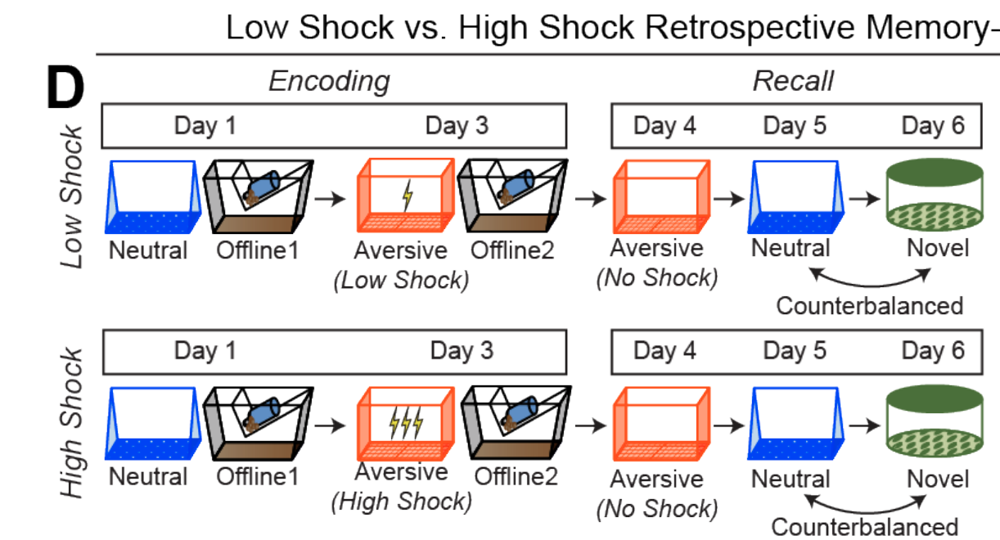
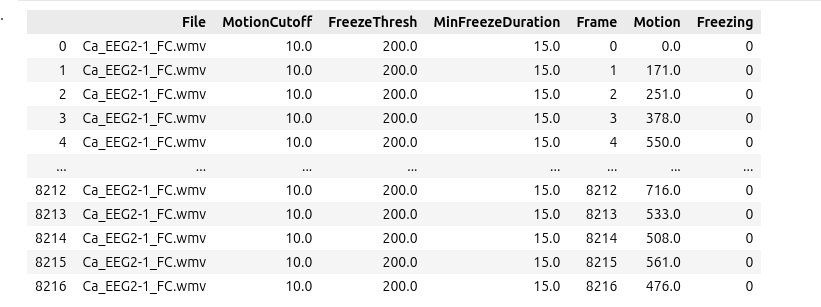

# Notes concerning the Zaki 2024 conversion


## General Information
The lab page
https://www.denisecailab.com/

Med associated (a software that they used):

https://med-associates.com/product-category/software-all/software-software/


## Questions and To-do:
* Why sometimes the exposure has more than one attempt? Can you describe more about this?

* How comes that pyedflib is not able to read the EDF files? (this is probably the proprietary format that they used)
* What is `headOrientation.csv` inside a miniscope folder? (this is another feature of miniscope that they are not using in Zaki conversion. Maybe it would be good to get data with this features for future conversions)
* Where is the information of the context? that is, they say that they distinguish them by oddor and other features of the context, where is this.
* In the Miniscope data, there are folders with `failed_to_fix` and `bad_frames`. Can you tell me more about those things?
* What are the raw files like `Ca_EEG2-1_Recall3.raw`?
* How to synch the edf with the video (the freeze data is synch to the video)
* According to Alessandra notes, the behavior videos are synch to the miniscope data. I remember a pulse, can you confirm this? Basically, how to synch the miniscope data with the video? Usually they are part of the same system in miniscope, was it the case here?  
* What happens in day two? Are offline days 1 and 2 (which is actually three) different?
* Is the freezing output on the segmentation folder the same that the one in the corresponding imaging folder? It seems that they are for some files, confirm this.
* For the sleep data, the labels in the paper are : NREM, REM, WAKE (Extended Figure 9 F) but in the data we only found labels: 
        `sleep_states = ['quiet wake', 'rem', 'sws', 'wake']`

Relationship?

What version of miniscope they used? do they know how it changes the configuration, the data? THEY ARE USING V4.


## Experiment Protocol



What data is available per protocol day:

### Encoding
* Day 1:
  * Neutral:
    - Video of behavior
    - Calcium imaging and Segmentation
  * Offline
    - Calcium imaging and Segmentation
    - EEG and EMG
* Day 3:
  * Aversive - Fear Conditioning (FC):
    - Video of behavior
    - Calcium imaging and Segmentation
  * Offline
    - Calcium imaging and Segmentation
    - EEG and EMG

### Recall
* Day 4: 
  * Video of behavior
  * Calcium imaging and Segmentation
* Day 5: 5 minutes of video:
  * Video of behavior
* Day 6: 5 minutes of video
  * Video of behavior


A description of what I believe is the experiments we are converting the data for is given in the methods section of the paper:

> For calcium imaging experiments with simultaneous EEG and EMG recordings, mice lived in a custom-made homecage where offline recordings could take place. These homecages (Maze Engineers) were custom designed to accommodate mice wearing a Miniscope chronically for the duration of the experiment (about 2 weeks total). The water spout and food hopper were side-mounted and there was a slit along the top of the homecage so that the Miniscope coaxial cable could freely move. This homecage was placed on top of a receiver that would wirelessly receive EEG, EMG, temperature, and locomotion telemetry data continuously throughout the experiment (HD-X02, Data Science International). Mice had a Miniscope attached on the first day and allowed to wear it for an hour in their homecage to acclimate to its weight, after which it was removed. On the second day, the Miniscope was attached and remained on for the duration of the experiment, for a total of 2 weeks. The Miniscope was connected to a lightweight coaxial cable (Cooner Wire) which connected to a low-torque passive commutator (Neurotek) to allow the mice to freely move around the homecage with minimal rotational force. After exposure to the neutral context during encoding, mice were immediately returned to their homecage in the vivarium and the first calcium imaging recording began. The Miniscope DAQ was connected to an Arduino with a schedule set up to send a 10-minute long TTL pulse to record for 10 minutes, with a 20-minute break in between, repeated 24 times. Thus, we sampled 4 hours worth of calcium imaging data across 12 hours. The telemetry probe recorded continuously for the duration of the experiment while the mouse was in its homecage in the vivarium.


### Surgery 

This is the surgery performed on the experiments that we are converting the data for:

> For calcium imaging experiments with EEG/EMG implants, mice underwent three serial procedures spaced ~two weeks apart. During the first surgery, mice had 300nL of AAV1-Syn-GCaMP6f injected into dorsal CA1 as described above, but had the incision sutured after the surgery. Two weeks later during a second surgery, mice had their overlying cortex aspirated and a GRIN lens implanted above the injection site, as above. During this surgery, a wireless telemetry probe (HD-X02, Data Science International) was also implanted with EEG and EMG wires. Two EMG wires were implanted into the left trapezius muscle. One EEG wire was implanted between skull and dura mater above dorsal hippocampus on the contralateral hemisphere to the GRIN lens (left hemisphere; AP -2mm, ML -1.5mm), and a reference EEG wire was implanted between skull and dura on the right hemisphere overlying prefrontal cortex (AP + 1.75mm, ML -0.5mm). Cyanoacrylate and dental cement fixed the GRIN lens, anchor screw, and EEG wires in place. The telemetry probes were implanted during the second surgery rather than the first to minimize the time that the mice needed to live with the implant (because the mice sometimes reject the implant after long periods). During the third procedure, the mice were returned to implant the baseplate, as described above.

### Subject


Adult C57BL/6J wild-type mice from Jackson Laboratories were used in all experiments except for inhibitory tagging experiments (Extended Figures 5,6). In those experiments, Gad2-cre mice from Jackson Laboratories (or bred in-house from Jackson Laboratories) were used. Mice ordered from Jackson arrived group-housed in cages of 4 mice/cage and were singly housed for the experiment. For behavioral experiments where mice did not undergo surgery, mice were ordered to arrive at 12 weeks of age and underwent behavioral testing 1-2 weeks from then. For experiments where mice underwent surgery, mice were ordered to arrive at 8-9 weeks of age and underwent behavioral testing about 4-6 weeks after the arrival date. For experiments where mice underwent PSAM virus injections, mice were included in the experiment if there was expression of GFP+ cell bodies in both the dorsal and ventral hippocampus. All experimental procedures were approved by the Icahn School of Medicine at Mount Sinai’s IACUC.


## File structure

The top level of the data that they shared with us is divided by **modalities** and inside the modalities we have data for two subjects. 

```
├── Ca_EEG_Calcium  (this contains the segmentation data )
│   ├── Ca_EEG2-1
│   └── Ca_EEG3-4
├── Ca_EEG_EDF (this contains the EEG and EMG data)
│   ├── Ca_EEG2-1_EDF
│   └── Ca_EEG3-4_EDF
├── Ca_EEG_Experiment (this contains the raw minian data and videos)
│   ├── Ca_EEG2-1
│   └── Ca_EEG3-4 
└── Ca_EEG_Sleep  (Sleep data)
    ├── Ca_EEG2-1
    └── Ca_EEG3-4
```

### CA_EEG_Calcium

The structure is the same for both subjects.

They contain the minian data, a freezing output csv and the cell registration that contains csv files for each folder.


```
├── Ca_EEG2-1
│   ├── Ca_EEG2-1_FC
│   │   ├── Ca_EEG2-1_FC_FreezingOutput.csv
│   │   ├── metaData.json
│   │   └── minian
│   ├── Ca_EEG2-1_NeutralExposure
│   │   ├── Ca_EEG2-1_NeutralExposure_FreezingOutput.csv
│   │   ├── metaData.json
│   │   └── minian
│   ├── Ca_EEG2-1_OfflineDay2Session1
│   │   ├── metaData.json
│   │   └── minian
│   ├── Ca_EEG2-1_OfflineDay2Session10
│   │   ├── metaData.json
│   │   └── minian
│   ├── Ca_EEG2-1_OfflineDay2Session11
│   │   ├── metaData.json
│   │   └── minian
│   ├── Ca_EEG2-1_OfflineDay2Session12
│   │   ├── metaData.json
│   │   └── minian
│   ├── Ca_EEG2-1_OfflineDay2Session13
│   │   ├── metaData.json
│   │   └── minian
│   ├── Ca_EEG2-1_OfflineDay2Session14
│   │   ├── metaData.json
│   │   └── minian
│   ├── Ca_EEG2-1_OfflineDay2Session15
│   │   ├── metaData.json
│   │   └── minian
│   ├── Ca_EEG2-1_OfflineDay2Session16
│   │   ├── metaData.json
│   │   └── minian
│   ├── Ca_EEG2-1_OfflineDay2Session17
│   │   ├── metaData.json
│   │   └── minian
│   ├── Ca_EEG2-1_OfflineDay2Session18
│   │   ├── metaData.json
│   │   └── minian
│   ├── Ca_EEG2-1_OfflineDay2Session19
│   │   ├── metaData.json
│   │   └── minian
│   ├── Ca_EEG2-1_OfflineDay2Session2
│   │   ├── metaData.json
│   │   └── minian
│   ├── Ca_EEG2-1_OfflineDay2Session3
│   │   ├── metaData.json
│   │   └── minian
│   ├── Ca_EEG2-1_OfflineDay2Session4
│   │   ├── metaData.json
│   │   └── minian
│   ├── Ca_EEG2-1_OfflineDay2Session5
│   │   ├── metaData.json
│   │   └── minian
│   ├── Ca_EEG2-1_OfflineDay2Session6
│   │   ├── metaData.json
│   │   └── minian
│   ├── Ca_EEG2-1_OfflineDay2Session7
│   │   ├── metaData.json
│   │   └── minian
│   ├── Ca_EEG2-1_OfflineDay2Session8
│   │   ├── metaData.json
│   │   └── minian
│   ├── Ca_EEG2-1_OfflineDay2Session9
│   │   ├── metaData.json
│   │   └── minian
│   ├── Ca_EEG2-1_Recall1
│   │   ├── Ca_EEG2-1_Recall1_FreezingOutput.csv
│   │   ├── metaData.json
│   │   └── minian
│   ├── Ca_EEG2-1_Recall2
│   │   └── Ca_EEG2-1_Recall2_FreezingOutput.csv
│   ├── Ca_EEG2-1_Recall3
│   │   └── Ca_EEG2-1_Recall3_FreezingOutput.csv
│   └── SpatialFootprints
│       ├── CellRegResults_OfflineDay2Session1
│       ├── CellRegResults_OfflineDay2Session10
│       ├── CellRegResults_OfflineDay2Session11
│       ├── CellRegResults_OfflineDay2Session12
│       ├── CellRegResults_OfflineDay2Session13
│       ├── CellRegResults_OfflineDay2Session14
│       ├── CellRegResults_OfflineDay2Session15
│       ├── CellRegResults_OfflineDay2Session16
│       ├── CellRegResults_OfflineDay2Session17
│       ├── CellRegResults_OfflineDay2Session18
│       ├── CellRegResults_OfflineDay2Session19
│       ├── CellRegResults_OfflineDay2Session2
│       ├── CellRegResults_OfflineDay2Session3
│       ├── CellRegResults_OfflineDay2Session4
│       ├── CellRegResults_OfflineDay2Session5
│       ├── CellRegResults_OfflineDay2Session6
│       ├── CellRegResults_OfflineDay2Session7
│       ├── CellRegResults_OfflineDay2Session8
│       └── CellRegResults_OfflineDay2Session9

```

The cell freezing output behavior csv looks like this:

TODO:
```

```

The cell registration csv looks like this:

TODO:
```
```


### CA_EEG_Experiment

The structure is:

```
.
├── Ca_EEG2-1_Offline
│   ├── Ca_EEG2-1_OfflineDay1
│   ├── Ca_EEG2-1_OfflineDay2
│   └── Ca_EEG2-1_OfflinePre
├── Ca_EEG2-1_Sessions
│   ├── Ca_EEG2-1_FC
│   ├── Ca_EEG2-1_NeutralExposure
│   ├── Ca_EEG2-1_Recall1
│   ├── Ca_EEG2-1_Recall2
│   └── Ca_EEG2-1_Recall3
└── Session_Timestamps.csv

```


Contains a file named `Session_Timestamps.csv` that looks like this:


The offline data looks different from the sessions data. The sessions are the context and they look like this:

```
├── Ca_EEG2-1_FC
│   ├── 10_11_24
│   │   ├── metaData.json
│   │   ├── Miniscope
│   │   │   ├── 0.avi
│   │   │   ├── 1.avi
│   │   │   ├── 2.avi
│   │   │   ├── 3.avi
│   │   │   ├── 4.avi
│   │   │   ├── 5.avi
│   │   │   ├── 6.avi
│   │   │   ├── 7.avi
│   │   │   ├── 8.avi
│   │   │   ├── headOrientation.csv
│   │   │   ├── metaData.json
│   │   │   ├── minian.mp4
│   │   │   └── timeStamps.csv
│   │   └── notes.csv
│   ├── Ca_EEG2-1_FC_FreezingOutput.csv
│   ├── Ca_EEG2-1_FC.raw
│   ├── Ca_EEG2-1_FC.txt
│   └── Ca_EEG2-1_FC.wmv
├── Ca_EEG2-1_NeutralExposure
│   ├── 10_43_54_first_attempt
│   │   ├── metaData.json
│   │   ├── Miniscope
│   │   │   ├── 0.avi
│   │   │   ├── headOrientation.csv
│   │   │   ├── metaData.json
│   │   │   └── timeStamps.csv
│   │   └── notes.csv
│   ├── 10_44_18
│   │   ├── metaData.json
│   │   ├── Miniscope
│   │   │   ├── 0.avi
│   │   │   ├── 10.avi
│   │   │   ├── 11.avi
│   │   │   ├── 12.avi
│   │   │   ├── 13.avi
│   │   │   ├── 14.avi
│   │   │   ├── 15.avi
│   │   │   ├── 16.avi
│   │   │   ├── 17.avi
│   │   │   ├── 1.avi
│   │   │   ├── 2.avi
│   │   │   ├── 3.avi
│   │   │   ├── 4.avi
│   │   │   ├── 5.avi
│   │   │   ├── 6.avi
│   │   │   ├── 7.avi
│   │   │   ├── 8.avi
│   │   │   ├── 9.avi
│   │   │   ├── bad_frames
│   │   │   │   ├── 14811.png
│   │   │   │   ├── 15018.png
│   │   │   │   ├── 15098.png
│   │   │   │   └── 15099.png
│   │   │   ├── failed_to_fix
│   │   │   │   ├── 14.avi
│   │   │   │   └── 15.avi
│   │   │   ├── headOrientation.csv
│   │   │   ├── metaData.json
│   │   │   ├── minian.mp4
│   │   │   ├── originals
│   │   │   │   ├── 14.avi
│   │   │   │   └── 15.avi
│   │   │   └── timeStamps.csv
│   │   └── notes.csv
│   ├── Ca_EEG2-1_NeutralExposure_first_attempt.raw
│   ├── Ca_EEG2-1_NeutralExposure_first_attempt.txt
│   ├── Ca_EEG2-1_NeutralExposure_first_attempt.wmv
│   ├── Ca_EEG2-1_NeutralExposure_FreezingOutput.csv
│   ├── Ca_EEG2-1_NeutralExposure.raw
│   ├── Ca_EEG2-1_NeutralExposure.txt
│   └── Ca_EEG2-1_NeutralExposure.wmv
├── Ca_EEG2-1_Recall1
│   ├── 10_33_20
│   │   ├── metaData.json
│   │   ├── Miniscope
│   │   │   ├── 0.avi
│   │   │   ├── 1.avi
│   │   │   ├── 2.avi
│   │   │   ├── 3.avi
│   │   │   ├── 4.avi
│   │   │   ├── 5.avi
│   │   │   ├── 6.avi
│   │   │   ├── 7.avi
│   │   │   ├── 8.avi
│   │   │   ├── headOrientation.csv
│   │   │   ├── metaData.json
│   │   │   ├── minian.mp4
│   │   │   └── timeStamps.csv
│   │   └── notes.csv
│   ├── Ca_EEG2-1_Recall1_FreezingOutput.csv
│   ├── Ca_EEG2-1_Recall1.raw
│   ├── Ca_EEG2-1_Recall1.txt
│   └── Ca_EEG2-1_Recall1.wmv
├── Ca_EEG2-1_Recall2
│   ├── Ca_EEG2-1_Recall2_FreezingOutput.csv
│   ├── Ca_EEG2-1_Recall2.raw
│   ├── Ca_EEG2-1_Recall2.txt
│   └── Ca_EEG2-1_Recall2.wmv
└── Ca_EEG2-1_Recall3
    ├── Ca_EEG2-1_Recall3_FreezingOutput.csv
    ├── Ca_EEG2-1_Recall3.raw
    ├── Ca_EEG2-1_Recall3.txt
    └── Ca_EEG2-1_Recall3.wmv

```

As we can see the recall 2 and 3 have video but no imaging and segmentation data. The first day of recall, the fear conditioning and the neutral exposure have video, calcium imaging and segmentation data. For some reasons sometimes the neutral exposure has more than one attempt.

The offline days are structured like this:

```
├── Ca_EEG2-1_OfflineDay1
│   └── 2021_10_12
│       ├── 10_05_57
│       ├── 10_08_17
│       ├── 10_10_44
│       ├── 10_15_50
│       └── 12_07_50
├── Ca_EEG2-1_OfflineDay2
│   └── 2021_10_14
│       ├── 09_24_27
│       ├── 09_54_27
│       ├── 10_24_27
│       ├── 10_54_27
│       ├── 11_24_26
│       ├── 11_54_26
│       ├── 12_24_26
│       ├── 12_54_26
│       ├── 13_24_26
│       ├── 13_54_26
│       ├── 14_24_25
│       ├── 14_54_25
│       ├── 15_24_25
│       ├── 15_54_25
│       ├── 16_24_25
│       ├── 16_54_24
│       ├── 17_24_24
│       ├── 17_54_24
│       └── 18_24_24
└── Ca_EEG2-1_OfflinePre
    └── 2021_10_10
        ├── 11_05_22
        ├── 11_35_22
        ├── 12_05_22
        ├── 12_35_22
        ├── 13_05_21
        ├── 13_35_21
        ├── 14_05_21
        ├── 14_35_21
        ├── 15_05_21
        ├── 15_35_21
        ├── 16_05_20
        └── 16_35_20
```

And each of them is a date followed by a timestamp that has the miniscope data and the notes. They look like this:

```
├── 10_05_57
│   ├── behaviorTracker
│   ├── metaData.json
│   ├── My_V4_Miniscope
│   └── notes.csv
├── 10_08_17
│   ├── behaviorTracker
│   ├── metaData.json
│   ├── My_V4_Miniscope
│   └── notes.csv
├── 10_10_44
│   ├── behaviorTracker
│   ├── metaData.json
│   ├── My_V4_Miniscope
│   └── notes.csv
├── 10_15_50
│   ├── behaviorTracker
│   ├── metaData.json
│   ├── My_V4_Miniscope
│   └── notes.csv
└── 12_07_50
    ├── behaviorTracker
    ├── metaData.json
    ├── My_V4_Miniscope
    └── notes.csv

```

Inside the behavior tracking in the raw data for offline data there is a pose.csv, what is it?

### Ca_EEG_Sleep 

The sleep looks like this

```
├── Ca_EEG2-1
│   ├── AlignedSleep
│   │   ├── Ca_EEG2-1_OfflineDay2Session10_AlignedSleep.csv
│   │   ├── Ca_EEG2-1_OfflineDay2Session11_AlignedSleep.csv
│   │   ├── Ca_EEG2-1_OfflineDay2Session12_AlignedSleep.csv
│   │   ├── Ca_EEG2-1_OfflineDay2Session13_AlignedSleep.csv
│   │   ├── Ca_EEG2-1_OfflineDay2Session14_AlignedSleep.csv
│   │   ├── Ca_EEG2-1_OfflineDay2Session15_AlignedSleep.csv
│   │   ├── Ca_EEG2-1_OfflineDay2Session16_AlignedSleep.csv
│   │   ├── Ca_EEG2-1_OfflineDay2Session17_AlignedSleep.csv
│   │   ├── Ca_EEG2-1_OfflineDay2Session18_AlignedSleep.csv
│   │   ├── Ca_EEG2-1_OfflineDay2Session19_AlignedSleep.csv
│   │   ├── Ca_EEG2-1_OfflineDay2Session1_AlignedSleep.csv
│   │   ├── Ca_EEG2-1_OfflineDay2Session2_AlignedSleep.csv
│   │   ├── Ca_EEG2-1_OfflineDay2Session3_AlignedSleep.csv
│   │   ├── Ca_EEG2-1_OfflineDay2Session4_AlignedSleep.csv
│   │   ├── Ca_EEG2-1_OfflineDay2Session5_AlignedSleep.csv
│   │   ├── Ca_EEG2-1_OfflineDay2Session6_AlignedSleep.csv
│   │   ├── Ca_EEG2-1_OfflineDay2Session7_AlignedSleep.csv
│   │   ├── Ca_EEG2-1_OfflineDay2Session8_AlignedSleep.csv
│   │   └── Ca_EEG2-1_OfflineDay2Session9_AlignedSleep.csv
│   ├── Ca_EEG2-1_avgsummary.csv
│   ├── Ca_EEG2-1_powersummary.csv
│   ├── Ca_EEG2-1_summary.pickle
│   └── Ca_EEG2-1_transitions.pickle
└── Ca_EEG3-4
    ├── AlignedSleep
    │   ├── Ca_EEG3-4_OfflineDay1Session10_AlignedSleep.csv
    │   ├── Ca_EEG3-4_OfflineDay1Session11_AlignedSleep.csv
    │   ├── Ca_EEG3-4_OfflineDay1Session12_AlignedSleep.csv
    │   ├── Ca_EEG3-4_OfflineDay1Session13_AlignedSleep.csv
    │   ├── Ca_EEG3-4_OfflineDay1Session14_AlignedSleep.csv
    │   ├── Ca_EEG3-4_OfflineDay1Session15_AlignedSleep.csv
    │   ├── Ca_EEG3-4_OfflineDay1Session16_AlignedSleep.csv
    │   ├── Ca_EEG3-4_OfflineDay1Session17_AlignedSleep.csv
    │   ├── Ca_EEG3-4_OfflineDay1Session18_AlignedSleep.csv
    │   ├── Ca_EEG3-4_OfflineDay1Session19_AlignedSleep.csv
    │   ├── Ca_EEG3-4_OfflineDay1Session1_AlignedSleep.csv
    │   ├── Ca_EEG3-4_OfflineDay1Session20_AlignedSleep.csv
    │   ├── Ca_EEG3-4_OfflineDay1Session21_AlignedSleep.csv
    │   ├── Ca_EEG3-4_OfflineDay1Session22_AlignedSleep.csv
    │   ├── Ca_EEG3-4_OfflineDay1Session23_AlignedSleep.csv
    │   ├── Ca_EEG3-4_OfflineDay1Session2_AlignedSleep.csv
    │   ├── Ca_EEG3-4_OfflineDay1Session3_AlignedSleep.csv
    │   ├── Ca_EEG3-4_OfflineDay1Session4_AlignedSleep.csv
    │   ├── Ca_EEG3-4_OfflineDay1Session5_AlignedSleep.csv
    │   ├── Ca_EEG3-4_OfflineDay1Session6_AlignedSleep.csv
    │   ├── Ca_EEG3-4_OfflineDay1Session7_AlignedSleep.csv
    │   ├── Ca_EEG3-4_OfflineDay1Session8_AlignedSleep.csv
    │   ├── Ca_EEG3-4_OfflineDay1Session9_AlignedSleep.csv
    │   ├── Ca_EEG3-4_OfflineDay2Session10_AlignedSleep.csv
    │   ├── Ca_EEG3-4_OfflineDay2Session11_AlignedSleep.csv
    │   ├── Ca_EEG3-4_OfflineDay2Session12_AlignedSleep.csv
    │   ├── Ca_EEG3-4_OfflineDay2Session13_AlignedSleep.csv
    │   ├── Ca_EEG3-4_OfflineDay2Session14_AlignedSleep.csv
    │   ├── Ca_EEG3-4_OfflineDay2Session15_AlignedSleep.csv
    │   ├── Ca_EEG3-4_OfflineDay2Session16_AlignedSleep.csv
    │   ├── Ca_EEG3-4_OfflineDay2Session17_AlignedSleep.csv
    │   ├── Ca_EEG3-4_OfflineDay2Session18_AlignedSleep.csv
    │   ├── Ca_EEG3-4_OfflineDay2Session19_AlignedSleep.csv
    │   ├── Ca_EEG3-4_OfflineDay2Session1_AlignedSleep.csv
    │   ├── Ca_EEG3-4_OfflineDay2Session20_AlignedSleep.csv
    │   ├── Ca_EEG3-4_OfflineDay2Session21_AlignedSleep.csv
    │   ├── Ca_EEG3-4_OfflineDay2Session22_AlignedSleep.csv
    │   ├── Ca_EEG3-4_OfflineDay2Session23_AlignedSleep.csv
    │   ├── Ca_EEG3-4_OfflineDay2Session24_AlignedSleep.csv
    │   ├── Ca_EEG3-4_OfflineDay2Session2_AlignedSleep.csv
    │   ├── Ca_EEG3-4_OfflineDay2Session3_AlignedSleep.csv
    │   ├── Ca_EEG3-4_OfflineDay2Session4_AlignedSleep.csv
    │   ├── Ca_EEG3-4_OfflineDay2Session5_AlignedSleep.csv
    │   ├── Ca_EEG3-4_OfflineDay2Session6_AlignedSleep.csv
    │   ├── Ca_EEG3-4_OfflineDay2Session7_AlignedSleep.csv
    │   ├── Ca_EEG3-4_OfflineDay2Session8_AlignedSleep.csv
    │   └── Ca_EEG3-4_OfflineDay2Session9_AlignedSleep.csv
    ├── Ca_EEG3-4_091722.pickle__dropped.csv
    ├── Ca_EEG3-4_091922.pickle__dropped.csv
    ├── Ca_EEG3-4_avgsummary.csv
    ├── Ca_EEG3-4_powersummary.csv
    ├── Ca_EEG3-4_summary.pickle
    └── Ca_EEG3-4_transitions.pickle
```

### Ca_EEG_EDF

These files are full day recordings. Their filename contains a timestamps with american format of month first.

```
├── Ca_EEG2-1_EDF
│   ├── Ca_EEG2-1_100821.edf
│   ├── Ca_EEG2-1_100821.pickle
│   ├── Ca_EEG2-1_100921.edf
│   ├── Ca_EEG2-1_100921.pickle
│   ├── Ca_EEG2-1_101021.edf
│   ├── Ca_EEG2-1_101021.pickle
│   ├── Ca_EEG2-1_101121.edf
│   ├── Ca_EEG2-1_101121.pickle
│   ├── Ca_EEG2-1_101221.edf
│   ├── Ca_EEG2-1_101221.pickle
│   ├── Ca_EEG2-1_101321.edf
│   ├── Ca_EEG2-1_101321.pickle
│   ├── Ca_EEG2-1_101421.edf
│   ├── Ca_EEG2-1_101421.pickle
│   ├── Ca_EEG2-1_101521.edf
│   ├── Ca_EEG2-1_101521.pickle
│   ├── Ca_EEG2-1_101621.edf
│   ├── Ca_EEG2-1_101621.pickle
│   ├── Ca_EEG2-1_101721.edf
│   ├── Ca_EEG2-1_101721.pickle
│   ├── images
│   └── summary_files
└── Ca_EEG3-4_EDF
    ├── Ca_EEG3-4_091222.edf
    ├── Ca_EEG3-4_091222.pickle
    ├── Ca_EEG3-4_091322.edf
    ├── Ca_EEG3-4_091322.pickle
    ├── Ca_EEG3-4_091422.edf
    ├── Ca_EEG3-4_091422.pickle
    ├── Ca_EEG3-4_091522.edf
    ├── Ca_EEG3-4_091522.pickle
    ├── Ca_EEG3-4_091622.edf
    ├── Ca_EEG3-4_091622.pickle
    ├── Ca_EEG3-4_091722.edf
    ├── Ca_EEG3-4_091722.pickle
    ├── Ca_EEG3-4_091822.edf
    ├── Ca_EEG3-4_091822.pickle
    ├── Ca_EEG3-4_091922.edf
    ├── Ca_EEG3-4_091922.pickle
    ├── Ca_EEG3-4_092022.edf
    ├── Ca_EEG3-4_092022.pickle
    ├── Ca_EEG3-4_092122.edf
    ├── Ca_EEG3-4_092122.pickle
    ├── Ca_EEG3-4_092222.edf
    ├── Ca_EEG3-4_092222.pickle
    ├── Ca_EEG3-4_092322.edf
    ├── Ca_EEG3-4_092322.pickle
    ├── images
    └── summary_files

```
## EDF (EEG and MEG)

The EDF format specification:
https://doi.org/10.1016/S1388-2457(03)00123-8

The pickle files related to the edf data can be ignored.

### Exploration with MNE

The chann


```python

from mne.io import read_raw_edf

raw = read_raw_edf(input_fname=file_path)
info = raw.info
raw.info["ch_names"]
['Activity', 'BattVolt', 'EEG', 'EMG', 'OnTime', 'SignalStr', 'Temp']

```

Here is a description of the channel after the discussion with Joe Zaki on 2024-10-20:

* OnTime: not used, should ignore.
* BaTTVolt: Battery voltage of the transmitter.
* SignalStr: How strong the signal of the wirless transmission is, this can be used for quality control as well as to know when the animals are taken out of the cage.
* Activity: It usees the motion of the probe relative to the receiver to creater a sudo locomotion. They don't use in the experiment but seems useful to have.

A visual representation of the setup can be found here:
https://www.datasci.com/telemetry


#### Data Extraction
The paper mentions two wires for the EEG and MEG but that's because one is the reference.

To extract the data the following methods are available:

https://mne.tools/stable/auto_tutorials/raw/10_raw_overview.html#summary-of-ways-to-extract-data-from-raw-objects

```python

raw_data_numpy = raw[:]
data, times = raw_data_numpy

data = raw.get_data()


More specific channel info can be found:

```python
info["chs"]
[{'cal': 1.0,
  'logno': 1,
  'scanno': 1,
  'range': 1.0,
  'unit_mul': 0 (FIFF_UNITM_NONE),
  'ch_name': 'Activity',
  'unit': 107 (FIFF_UNIT_V),
  'coord_frame': 4 (FIFFV_COORD_HEAD),
  'coil_type': 1 (FIFFV_COIL_EEG),
  'kind': 2 (FIFFV_EEG_CH),
  'loc': array([nan, nan, nan, nan, nan, nan, nan, nan, nan, nan, nan, nan])},
 {'cal': 1.0,
  'logno': 2,
  'scanno': 2,
  'range': 1.0,
  'unit_mul': 0 (FIFF_UNITM_NONE),
  'ch_name': 'BattVolt',
  'unit': 107 (FIFF_UNIT_V),
  'coord_frame': 4 (FIFFV_COORD_HEAD),
  'coil_type': 1 (FIFFV_COIL_EEG),
  'kind': 2 (FIFFV_EEG_CH),
  'loc': array([nan, nan, nan, nan, nan, nan, nan, nan, nan, nan, nan, nan])},
 {'cal': 1.0,
  'logno': 3,
  'scanno': 3,
  'range': 1.0,
  'unit_mul': 0 (FIFF_UNITM_NONE),
  'ch_name': 'EEG',
  'unit': 107 (FIFF_UNIT_V),
  'coord_frame': 4 (FIFFV_COORD_HEAD),
  'coil_type': 1 (FIFFV_COIL_EEG),
  'kind': 2 (FIFFV_EEG_CH),
  'loc': array([nan, nan, nan, nan, nan, nan, nan, nan, nan, nan, nan, nan])},
 {'cal': 1.0,
  'logno': 4,
  'scanno': 4,
  'range': 1.0,
  'unit_mul': 0 (FIFF_UNITM_NONE),
  'ch_name': 'EMG',
  'unit': 107 (FIFF_UNIT_V),
  'coord_frame': 4 (FIFFV_COORD_HEAD),
  'coil_type': 1 (FIFFV_COIL_EEG),
  'kind': 2 (FIFFV_EEG_CH),
  'loc': array([nan, nan, nan, nan, nan, nan, nan, nan, nan, nan, nan, nan])},
 {'cal': 1.0,
  'logno': 5,
  'scanno': 5,
  'range': 1.0,
  'unit_mul': 0 (FIFF_UNITM_NONE),
  'ch_name': 'OnTime',
  'unit': 107 (FIFF_UNIT_V),
  'coord_frame': 4 (FIFFV_COORD_HEAD),
  'coil_type': 1 (FIFFV_COIL_EEG),
  'kind': 2 (FIFFV_EEG_CH),
  'loc': array([nan, nan, nan, nan, nan, nan, nan, nan, nan, nan, nan, nan])},
 {'cal': 1.0,
  'logno': 6,
  'scanno': 6,
  'range': 1.0,
  'unit_mul': 0 (FIFF_UNITM_NONE),
  'ch_name': 'SignalStr',
  'unit': 107 (FIFF_UNIT_V),
  'coord_frame': 4 (FIFFV_COORD_HEAD),
  'coil_type': 1 (FIFFV_COIL_EEG),
  'kind': 2 (FIFFV_EEG_CH),
  'loc': array([nan, nan, nan, nan, nan, nan, nan, nan, nan, nan, nan, nan])},
 {'cal': 1.0,
  'logno': 7,
  'scanno': 7,
  'range': 1.0,
  'unit_mul': 0 (FIFF_UNITM_NONE),
  'ch_name': 'Temp',
  'unit': 107 (FIFF_UNIT_V),
  'coord_frame': 4 (FIFFV_COORD_HEAD),
  'coil_type': 1 (FIFFV_COIL_EEG),
  'kind': 2 (FIFFV_EEG_CH),
  'loc': array([nan, nan, nan, nan, nan, nan, nan, nan, nan, nan, nan, nan])}]

```


### Device:
HD-X02, Data Science International. The sheet is [here](https://www.datasci.com/docs/default-source/implantable-telemetry/hd-x02_s02.pdf)


## Miniscope

Talks about the topic:
https://sites.google.com/metacell.us/miniscope-workshop-2021

Usual DAQ software for Miniscope is GPIOx3.

The expected structure of the file according to the Miniscope wiki is described here:

http://miniscope.org/index.php/Data_Acquisition_Software

But that does not match the structure of the files discussed above.

Also, check out here:
https://github.com/catalystneuro/roiextractors/issues/356

**The difference in folder organization is a version number**

V4 just enumerates them in the same folder.
This is because this is more general to add arbitrary behavioral cameras (you don't need the behavior)

Right 

Other changes

AMU: Inertia Motion 


`pose.csv` is related to deep lab cut estimation of the pose of the animal. This is a feature on the latest version of minian that is currently not used in this conversion.


This is the metadata file in the same directory that the minian videos:
```json
{
    "compression": "FFV1",
    "deviceDirectory": "C:/Users/CaiLab/Documents//Joe/Ca_EEG2/Ca_EEG2-1/2021_10_14/10_11_24/Miniscope",
    "deviceID": 0,
    "deviceName": "Miniscope",
    "deviceType": "Miniscope_V4_BNO",
    "ewl": 70,
    "frameRate": "30FPS",
    "framesPerFile": 1000,
    "gain": 3.5,
    "led0": 12
}
```

And this is the one in the parent folder. Both are called `metaData.json`

```json
{
    "animalName": "Ca_EEG2-1",
    "baseDirectory": "C:/Users/CaiLab/Documents//Joe/Ca_EEG2/Ca_EEG2-1/2021_10_14/10_11_24",
    "cameras": [
    ],
    "day": 14,
    "experimentName": "Ca_EEG2",
    "hour": 10,
    "miniscopes": [
        "Miniscope"
    ],
    "minute": 11,
    "month": 10,
    "msec": 779,
    "msecSinceEpoch": 1634220684779,
    "researcherName": "Joe",
    "second": 24,
    "year": 2021
}
```

## Cross Registration


> Cells recorded across sessions within a mouse were cross-registered using a previously published open-source cross-registration algorithm, CellReg, using the spatial correlations of nearby cells to determine whether highly correlated footprints close in space are likely to be the same cell across sessions. For calcium imaging experiments with EEG/EMG, each offline recording was cross-registered with all the encoding and recall sessions, but not with the other offline sessions because cross-registering between all sessions would lead to too many conflicts and thus, to no cells cross-registered across all sessions.


## Segmentation

Paper:
https://elifesciences.org/articles/70661

Github:
https://github.com/denisecailab/minian

Read the docs:
https://minian.readthedocs.io/en/stable/

## Freezing Behavior and Video

This data was extracted from the the ezTrack package:
This is how the data looks like:



MotionCutoff, FreezeThreshd, MinFreezeDuration are the same for the whole dataframe. The seem to be the parameters of the algorithm.

Freeze Threshold: 
MotionCuttoff: minimal pixel change so "it is moving" 
FreezeThreshold: the motion across some frames has to be
MinFreezeDuration: 


Description of the columns:
* Frame: Of the video
* Motion: This s a float, an int? what it indicates? Aggregated pixel change from frame to frame as a measure of the motion. Higher means more change so more motion. 
* Freezing: This is a boolean, 100 is freezing, 0 is not not

According to Alessandra notes the behavioral videos are synch to the miniscope data. 
We have some tracking in other experiments. They don't have behavior tracking. 


###  ezTrack

The webpage:
https://github.com/denisecailab/ezTrack

This package is used for two things:
1) Track the position of the animal in the open field. A detailed walkthrough of the capabilities can be found here:

https://youtu.be/BKgh-XcZhIM?t=1905

2) The freezing behavior analysis that is done for this specific conversion.

## Sleep

The data looks like this:

| Index | Frame | SleepState |
|-------|-------|------------|
|     0 |     0 | wake       |
|     1 |     1 | wake       |
|     2 |     2 | wake       |
|     3 |     3 | wake       |
|     4 |     4 | wake       |
|     5 |     5 | wake       |


The possible sleep states are:
* wake
* quite wake
* sws (slow wave sleep)
* rem

* The aligned sleep data has a column called frame but the corresponding ophys data is many videos? Again, how are they aligned? is the frame aggregated? In this case they are aligned to an idealized clock. They interpolated from the video timestamps that used the perfect sampling rate. Check this with the authors when we are working with synchronization.


## Some synch information
How does the miniscope system synchs, here in this video are some notes:

https://youtu.be/BKgh-XcZhIM?t=731


More about synch can be found in the video to align with behavior on this timestamp
https://youtu.be/BKgh-XcZhIM?t=1338